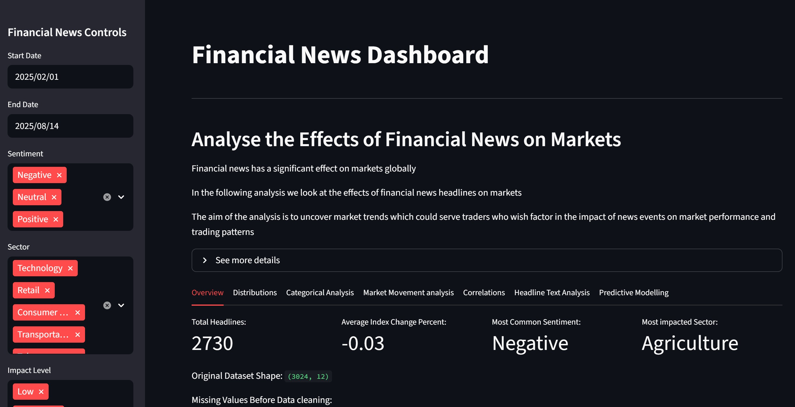

# Financial News Dashboard

## Overview
This project is an interactive dashboard which analyses the effects of financial news headlines on market performance.
The project provides insights into:
- Market movements linked to financial news
- Trading volume fluctuations
- Sector specific effects of news events
- Text analysis of headlines
- Predictive modelling using decision trees
The goal is to help traders, analysts and reseachers understand how news headlines correlate with market behaviour.

## Features
There are 7 tabs:
-Overview
-Distributions
-Categorical analyis
-Market movement analysis
-Correlations
-Headline text analysis
-Predictive modelling

## Screenshot


## Installation
Clone the repository and install the dependencies:
```git@github.com:Lewis-Morton/financial_news_project.git```
```pip install -r requirements.txt```


## Usage
To run the app locally:
```streamlit run app.py```

## Data Preprocessing
Preprocessing done via Jupyter Notebooks
Includes cleaned, formatted, and encoded datasets

## Dependencies
Streamlit
Pandas
Matplotlib
Seaborn
NLTK
Scikit-learn
Full dependency list available in requirements.txt

## Future Work
Add and compare machine learning models for prediction
Integrate live news APIs for real-time analysis